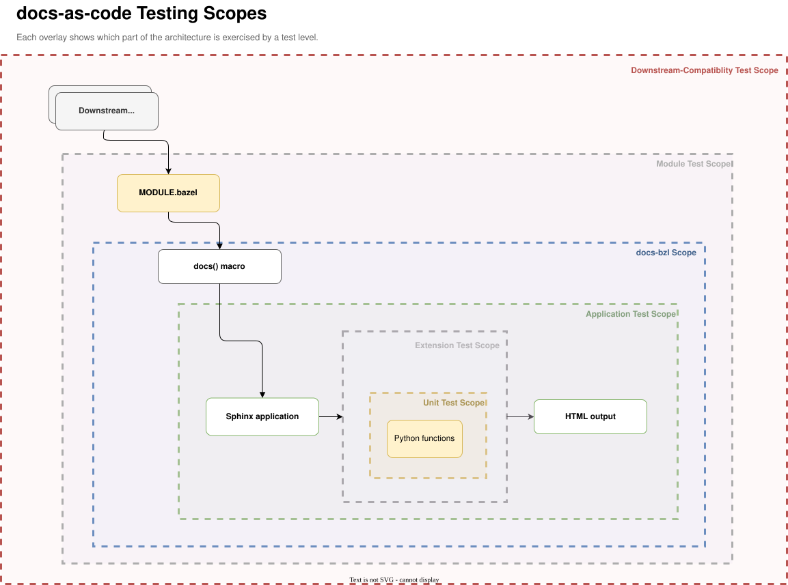

<!-- ----------------------------------------------------------------------------
  Copyright (c) 2026 Contributors to the Eclipse Foundation

  See the NOTICE file(s) distributed with this work for additional
  information regarding copyright ownership.

  This program and the accompanying materials are made available under the
  terms of the Apache License Version 2.0 which is available at
  https://www.apache.org/licenses/LICENSE-2.0

  SPDX-License-Identifier: Apache-2.0
----------------------------------------------------------------------------- -->

# Docs-As-Code Consumer Tests

# Testing



## end-to-end tests

*Also known as system, product, or black-box tests.*

This directory contains end-to-end tests, namely:

- `docs_bzl`: tests based on the public `docs()` macro. Must be executed via plain pytest (run via `.venv_docs`) as they execute real `bazel run`/`bazel build` internally. See [docs_bzl/README.md](docs_bzl/README.md) for details.

- `downstream_compatibility`: *(formerly consumer tests)* Tests local changes and Git-based overrides against real consumer repositories. This provides broad, intentionally less-controlled coverage and helps detect breaking changes in the docs-as-code system before they affect downstream consumers.

### Targets

You can query targets in this directory with:

```bash
bazel query 'kind(".*_test", //src/tests/...)'
```
